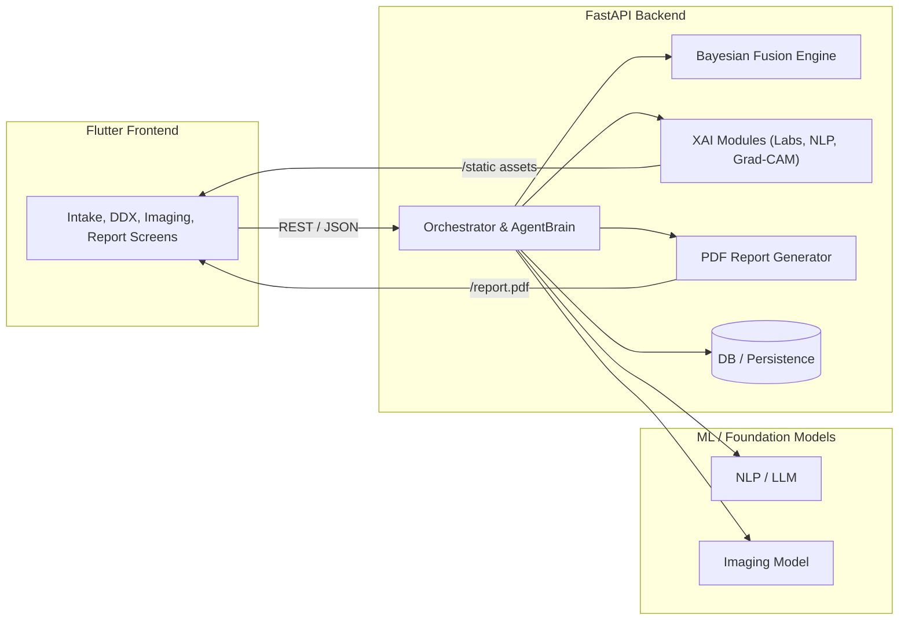
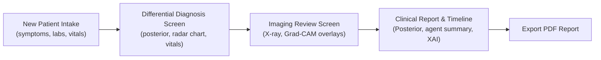
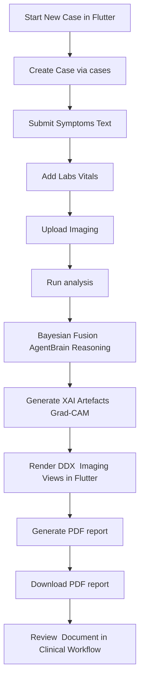
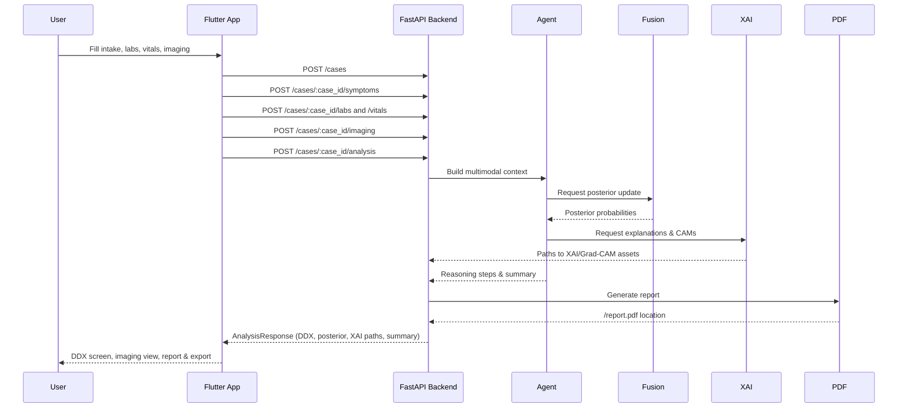

# Multi‑Modal Clinical AI Agent

This repository contains a **multi‑modal clinical workflow assistant** with:

- **Backend**: FastAPI service for case orchestration, multimodal models, XAI, and reporting.
- **Frontend**: Flutter app for interactive clinical review and decision support.

The system ingests **symptoms (NLP)**, **labs**, **vitals**, and **imaging**, then produces
fused differential diagnosis, uncertainty‑aware reasoning, and rich explainability.

---

## System Architecture Overview


## UI Wireframes (Conceptual)


## End-to-End Process Flow


### Analysis API Sequence (Detailed)


## Project Structure

- `mm-hie-backend/`
  - `app/main.py` – FastAPI entrypoint, routers, static file mount (`/static`).
  - `app/orchestrator.py` – Orchestrates the full case flow, fusion, Bayesian updates, agent.
  - `app/fusion/bayes_updater.py` – Bayesian posterior updater for per‑condition probabilities.
  - `app/agent_brain.py` – Autonomous reasoning agent (`AgentBrain`).
  - `app/xai/` – Explainability modules (labs SHAP, NLP token highlights, Grad‑CAM utilities).
  - `app/utils/pdf_report.py` – PDF report generator including agent summary and XAI artefacts.
  - `app/db_models.py`, `app/crud.py`, `app/schemas.py` – Persistence and API schemas.
  - `tests/` – Unit tests for Bayesian updater, agent, XAI, imaging, timeline, etc.

- `frontend/`
  - `lib/main.dart` – Flutter app entrypoint and routes.
  - `lib/services/api_client.dart` – Client for backend case / analysis / report APIs.
  - `lib/screens/` – Feature screens:
    - `new_patient_intake_screen.dart` – Intake, data upload, synthetic vitals.
    - `differential_diagnosis_screen.dart` – DDX summary, modality radar chart, vitals sparkline.
    - `clinical_report_screen.dart` – Full clinical report with posterior, agent summary, XAI.
    - `imaging_review_screen.dart` – Advanced X‑ray / Grad‑CAM viewer.
  - `lib/widgets/` – Shared UI components:
    - `modality_radar_chart.dart` – Radar chart of modality contributions.
    - `vitals_sparkline.dart` – Real‑time style HR / SpO₂ sparkline.

Top‑level platform folders (`android/`, `ios/`, `macos/`, `linux/`, `windows/`, `web/`) are
generated by Flutter.

---

## Key Features

- **Bayesian posterior fusion**
  - `BayesianUpdater` combines prior (e.g. symptoms / NLP) with likelihoods from other modalities.
  - Per‑disease posterior probabilities surfaced in `AnalysisResponse.posterior_probabilities`.

- **Autonomous reasoning agent (AgentBrain)**
  - Produces stepwise reasoning, follow‑up suggestions, and confidence‑gain after each modality.
  - Actions are persisted as `AgentAction` entries and exposed in the case timeline.
  - A short `agent_summary` is included in analysis responses and PDF reports.

- **Explainable AI (XAI)**
  - **Labs SHAP‑style explainer**: computes simple contribution scores and waterfall‑like PNGs
    (`labs_shap_path` exposed via API and shown in the report UI).
  - **NLP token highlights**: `NLPExplainer` returns token→weight mappings for symptom text,
    allowing highlighted clinical phrases in the frontend.
  - **Grad‑CAM for imaging**: utilities generate raw heatmaps and blended overlays with colormaps.
    Overlays are saved under the project root and served via FastAPI static files (`/static`).

- **Advanced imaging viewer (Flutter)**
  - Pinch‑zoom and pan using `InteractiveViewer`.
  - Brightness slider via `ColorFiltered` and a brightness matrix.
  - Grad‑CAM overlay toggle and opacity control for visual exploration.

- **Modality radar chart & vitals visualisation**
  - `ModalityRadarChart` shows relative contributions of NLP, labs, imaging, and vitals.
  - `VitalsSparkline` draws HR / SpO₂ trends as overlaid sparklines.

---

## Backend: Setup & Run (FastAPI)

From the repository root:

```bash
cd mm-hie-backend

# (Optional) create and activate a virtualenv, e.g.:
python -m venv .venv
source .venv/bin/activate  # Windows: .venv\\Scripts\\activate

pip install -r requirements.txt

# Run the API (reload for development)
uvicorn app.main:app --reload --host 0.0.0.0 --port 8000
```

Key endpoints (high‑level):

- `POST /cases` – Create a case.
- `POST /cases/{case_id}/symptoms` – Add symptoms / clinical text.
- `POST /cases/{case_id}/labs` – Add structured lab data or upload lab report.
- `POST /cases/{case_id}/vitals` – Add vitals (HR, SpO₂, temperature, resp rate).
- `POST /cases/{case_id}/imaging` – Add imaging; triggers imaging model + Grad‑CAM.
- `POST /cases/{case_id}/analysis` – Run full multimodal analysis.
- `GET /cases/{case_id}/timeline` – Case timeline including agent actions.
- `GET /cases/{case_id}/report.pdf` – Download PDF report with agent summary and XAI.
- `GET /static/...` – Serve Grad‑CAM and XAI image assets.

Run tests:

```bash
cd mm-hie-backend
pytest
```

---

## Frontend: Setup & Run (Flutter)

Prerequisites:

- Flutter SDK installed and on your `PATH`.
- A configured device or emulator (iOS Simulator, Android emulator, or Chrome for web).

From the repository root:

```bash
cd frontend
flutter pub get

# Run on a device / simulator
flutter run
```

The Flutter app expects the backend to be running on `http://localhost:8000`. If your backend
is hosted elsewhere, update the base URL in `lib/services/api_client.dart`.

---

## Core User Flows

1. **New patient intake**
   - Enter patient info and reason for visit.
   - Upload / enter symptoms, optional labs, and (synthetic) vitals.

2. **Run analysis & view DDX**
   - Backend performs multimodal analysis, Bayesian fusion, and reasoning.
   - DDX screen shows primary condition, triage, modality radar chart, and vitals sparkline.

3. **Imaging review**
   - Review X‑ray with Grad‑CAM overlays.
   - Adjust brightness and overlay opacity, zoom/pan to inspect regions of interest.

4. **Clinical report & timeline**
   - View posterior probabilities, agent summary, XAI artefacts, and timeline events.
   - Export a PDF report including a concise reasoning summary.

---

## Development Notes

- The backend code is intentionally modular: fusion, agent reasoning, and XAI are separable
  components wired together by the `Orchestrator`.
- The Flutter app is structured by **screens** and **widgets**, with a lightweight `ApiClient`
  that mirrors the backend schemas.
- Static image assets (Grad‑CAM overlays, SHAP plots) are written under the project tree and
  exposed via the FastAPI static mount at `/static` so Flutter can display them with `Image.network`.

---

## License

This repository is provided as‑is for experimentation and educational purposes. Adapt or extend
it to fit your own clinical AI workflows and deployment requirements.
