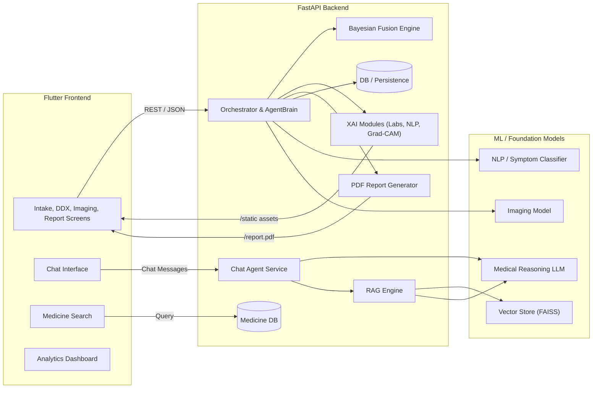
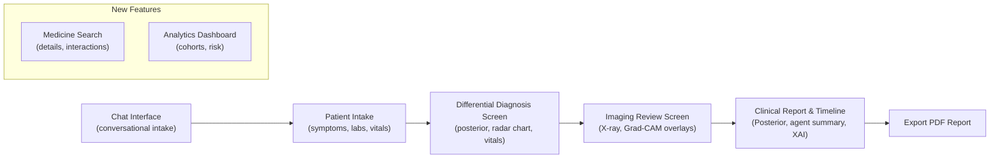
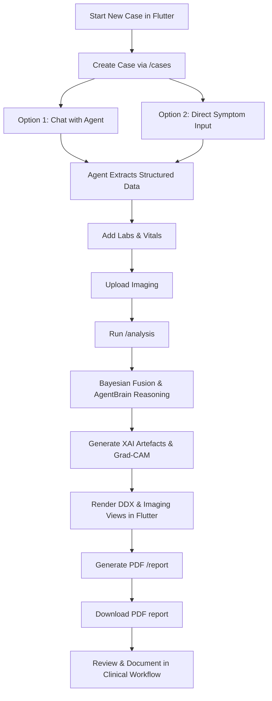
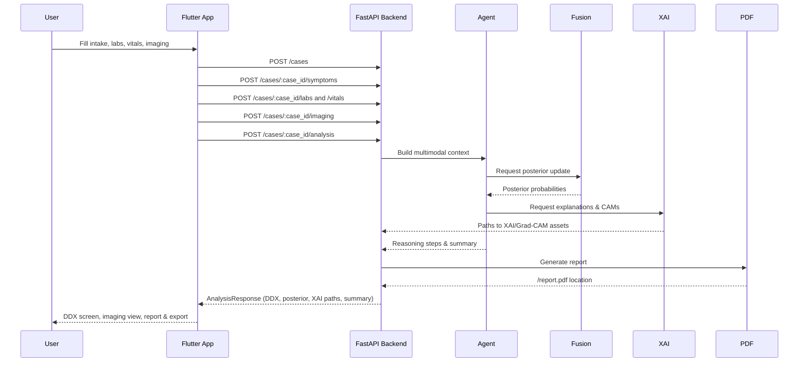

# Multi‑Modal Clinical AI Agent

This repository contains a **multi‑modal clinical workflow assistant** with:

- **Backend**: FastAPI service for case orchestration, multimodal models, conversational agent, RAG, XAI, and reporting.
- **Frontend**: Flutter app for interactive clinical review and decision support.

The system ingests **symptoms (NLP)**, **labs**, **vitals**, and **imaging**, then produces
fused differential diagnosis, uncertainty‑aware reasoning, and rich explainability. It features
an **LLM-driven conversational agent** for natural clinical interviews and **RAG-enhanced responses**
backed by medical knowledge retrieval.

---

## System Architecture Overview


## UI Wireframes (Conceptual)


## End-to-End Process Flow


### Analysis API Sequence (Detailed)


## Project Structure

- `mm-hie-backend/`
  - `app/main.py` – FastAPI entrypoint, routers, static file mount (`/static`).
  - `app/orchestrator.py` – Orchestrates the full case flow, fusion, Bayesian updates, agent.
  - `app/agent/` – **Conversational agent system**:
    - `chat_agent_service.py` – LLM-driven clinical interview agent.
    - `intent_classifier.py` – Intent detection for user messages.
    - `slot_extractor.py` – Structured data extraction from conversations.
    - `drug_checker.py` – Medication safety validation.
    - `followup_generator.py` – Automated follow-up question generation.
    - `agent_router.py` – Chat API endpoints.
  - `app/rag/` – **Retrieval-Augmented Generation system**:
    - `rag_engine.py` – Core RAG engine for knowledge retrieval.
    - `vector_store.py` – FAISS-based vector storage.
    - `embedder.py` – Sentence transformer embeddings.
    - `retrievers.py` – BM25 and semantic retrieval.
    - `prompts.py` – RAG prompt templates.
    - `rag_router.py` – RAG query endpoints.
  - `app/llm/` – **Medical reasoning LLM integration**:
    - `reasoning_model.py` – Medical LLM wrapper (dousery/medical-reasoning-gpt-oss-20b).
    - `reasoning_service.py` – FastAPI microservice for LLM inference.
    - `config.py` – Environment-based LLM configuration.
  - `app/routers/` – **Modular API routers**:
    - `cases_router.py` – Case management endpoints.
    - `timeline_router.py` – Case timeline endpoints.
    - `reports_router.py` – Report generation endpoints.
    - `medicines_router.py` – Medicine search endpoints.
  - `app/fusion/bayes_updater.py` – Bayesian posterior updater for per‑condition probabilities.
  - `app/agent_brain.py` – Autonomous reasoning agent (`AgentBrain`).
  - `app/xai/` – Explainability modules (labs SHAP, NLP token highlights, Grad‑CAM utilities).
  - `app/utils/pdf_report.py` – PDF report generator including agent summary and XAI artefacts.
  - `app/federated/` – Federated learning infrastructure.
  - `app/db_models.py`, `app/crud.py`, `app/schemas.py` – Persistence and API schemas.
  - `scripts/` – **Utility scripts**:
    - `prepare_rag_corpus.py` – RAG corpus preparation.
    - `fetch_medical_data.py` – Medical dataset fetching.
    - `ingest_pdfs.py` – PDF document ingestion.
    - `train_medical_lora.py` – LoRA fine-tuning.
  - `tests/` – Unit tests for Bayesian updater, agent, XAI, imaging, timeline, etc.

- `frontend/`
  - `lib/main.dart` – Flutter app entrypoint and routes.
  - `lib/services/api_client.dart` – Client for backend case / analysis / report APIs.
  - `lib/screens/` – Feature screens:
    - `new_patient_intake_screen.dart` – Intake, data upload, synthetic vitals.
    - `differential_diagnosis_screen.dart` – DDX summary, modality radar chart, vitals sparkline.
    - `clinical_report_screen.dart` – Full clinical report with posterior, agent summary, XAI.
    - `imaging_review_screen.dart` – Advanced X‑ray / Grad‑CAM viewer.
    - `search_screen.dart` – Medicine search and details.
    - `analytics_screen.dart` – Patient analytics dashboard.
  - `lib/widgets/` – Shared UI components:
    - `modality_radar_chart.dart` – Radar chart of modality contributions.
    - `vitals_sparkline.dart` – Real‑time style HR / SpO₂ sparkline.

- `mm-hie-training/` – Training code, configs, and experiments for multimodal models.
- `mm-hie-scale/` – Data ingestion, labeling, and ontology management pipelines.
- `FINE_TUNING_GUIDE.md` – Guide for fine-tuning medical LLMs.

Top‑level platform folders (`android/`, `ios/`, `macos/`, `linux/`, `windows/`, `web/`) are
generated by Flutter.

---

## Key Features

### Core Clinical Workflow

- **Bayesian posterior fusion**
  - `BayesianUpdater` combines prior (e.g. symptoms / NLP) with likelihoods from other modalities.
  - Per‑disease posterior probabilities surfaced in `AnalysisResponse.posterior_probabilities`.

- **Autonomous reasoning agent (AgentBrain)**
  - Produces stepwise reasoning, follow‑up suggestions, and confidence‑gain after each modality.
  - Actions are persisted as `AgentAction` entries and exposed in the case timeline.
  - A short `agent_summary` is included in analysis responses and PDF reports.

- **Explainable AI (XAI)**
  - **Labs SHAP‑style explainer**: computes simple contribution scores and waterfall‑like PNGs
    (`labs_shap_path` exposed via API and shown in the report UI).
  - **NLP token highlights**: `NLPExplainer` returns token→weight mappings for symptom text,
    allowing highlighted clinical phrases in the frontend.
  - **Grad‑CAM for imaging**: utilities generate raw heatmaps and blended overlays with colormaps.
    Overlays are saved under the project root and served via FastAPI static files (`/static`).

### Medicine Search Engine

- **Comprehensive Database**
  - Search for medicines by name.
  - View detailed information: composition, manufacturer, price, and pack size.
  
- **Safety Information**
  - Displays side effects and drug interactions.
  - Provides warnings for contraindications.

### Patient Analytics Dashboard

- **Cohort Visualization**
  - View total patient counts and high-risk patient statistics.
  - Visualise risk distribution (Low, Medium, High) across the patient population.

### Conversational Agent

- **LLM-driven clinical interview**
  - `ChatAgentService` uses a medical reasoning LLM to conduct natural, empathetic conversations.
  - Replaces rigid slot-filling with adaptive questioning based on patient responses.
  - Automatically extracts structured data in the background for analysis.

- **Intent classification & slot extraction**
  - `IntentClassifier` detects user intent (symptom reporting, question, medication query).
  - `SlotExtractor` extracts structured fields (symptoms, duration, severity, etc.).

- **Drug safety checking**
  - `DrugChecker` validates medication suggestions and provides safety warnings.
  - Mentions generic names and contraindications.

- **Follow-up generation**
  - `FollowupGenerator` creates contextual follow-up questions to gather missing information.

### RAG (Retrieval-Augmented Generation)

- **Medical knowledge retrieval**
  - `RAGEngine` combines BM25 and semantic search over medical knowledge corpus.
  - Retrieves relevant medical literature, guidelines, and case studies.

- **Vector store (FAISS)**
  - Efficient similarity search using sentence-transformer embeddings.
  - Supports both dense and sparse retrieval methods.

- **RAG-enhanced responses**
  - Agent responses are augmented with retrieved medical knowledge.
  - Improves accuracy and provides evidence-based recommendations.

### Medical Reasoning LLM

- **Model**: `dousery/medical-reasoning-gpt-oss-20b` (20B parameters)
- **Features**:
  - Device-aware loading (CPU/GPU/auto)
  - Quantization support (bitsandbytes, GPTQ, GGUF)
  - Configurable via environment variables
  - Can be deployed as a separate microservice
- **Fine-Tuning**: See [Fine-Tuning Guide](FINE_TUNING_GUIDE.md) for training custom models.

- **Hardware requirements**:
  - FP16: 40–50 GB GPU VRAM
  - 8-bit/4-bit quantization: 16–24 GB VRAM
  - CPU-only: >64 GB RAM (not recommended for production)

### Federated Learning

- **Privacy-preserving model updates**
  - Local training endpoint (`/train/local`) for federated learning rounds.
  - Supports FedAvg aggregation without sharing patient data.

### Advanced Imaging Viewer (Flutter)

- **Interactive visualization**
  - Pinch‑zoom and pan using `InteractiveViewer`.
  - Brightness slider via `ColorFiltered` and a brightness matrix.
  - Grad‑CAM overlay toggle and opacity control for visual exploration.

- **Modality radar chart & vitals visualisation**
  - `ModalityRadarChart` shows relative contributions of NLP, labs, imaging, and vitals.
  - `VitalsSparkline` draws HR / SpO₂ trends as overlaid sparklines.

---

## Backend: Setup & Run (FastAPI)

From the repository root:

```bash
cd mm-hie-backend

# (Optional) create and activate a virtualenv, e.g.:
python -m venv .venv
source .venv/bin/activate  # Windows: .venv\\Scripts\\activate

pip install -r requirements.txt

# (Optional) Prepare RAG corpus
python scripts/prepare_rag_corpus.py

# Configure LLM (optional - see LLM Configuration section)
export MMHIE_REASONER_MODEL=dousery/medical-reasoning-gpt-oss-20b
export MMHIE_DEVICE=auto
export MMHIE_QUANTIZE=bitsandbytes  # For lower VRAM usage

# Run the API (reload for development)
uvicorn app.main:app --reload --host 0.0.0.0 --port 8000
```

### LLM Configuration

Environment variables for LLM configuration:

- `MMHIE_REASONER_MODEL` (default: `dousery/medical-reasoning-gpt-oss-20b`)
- `MMHIE_DEVICE` (default: `auto`) — one of `auto|cpu|cuda`
- `MMHIE_DEVICE_MAP` (default: `auto`) — `auto|balanced|sequential|null`
- `MMHIE_MAX_TOKENS` (default: `512`)
- `MMHIE_QUANTIZE` (default: `none`) — one of `none|bitsandbytes|gptq|gguf`
- `MMHIE_TIMEOUT_SECONDS` (default: `30`)
- `MMHIE_MAX_INPUT_LENGTH` (default: `4096`)

For resource-constrained environments, consider:
- Using a smaller model (e.g., `facebook/opt-1.3b`)
- Enabling quantization (`MMHIE_QUANTIZE=bitsandbytes`)
- Running LLM as a separate microservice (see LLM Microservice section)

### Key Endpoints

#### Case Management
- `POST /cases` – Create a case.
- `GET /cases/{case_id}` – Get case details.
- `POST /cases/{case_id}/symptoms` – Add symptoms / clinical text.
- `POST /cases/{case_id}/labs` – Add structured lab data.
- `POST /cases/{case_id}/upload-report` – Upload lab report (OCR).
- `POST /cases/{case_id}/vitals` – Add vitals (HR, SpO₂, temperature, resp rate).
- `POST /cases/{case_id}/imaging` – Add imaging; triggers imaging model + Grad‑CAM.
- `POST /cases/{case_id}/upload-image` – Upload medical image.

#### Analysis & Reports
- `POST /cases/{case_id}/analysis` – Run full multimodal analysis.
- `GET /cases/{case_id}/timeline` – Case timeline including agent actions.
- `GET /cases/{case_id}/report.pdf` – Download PDF report with agent summary and XAI.

#### Medicine Search
- `GET /medicines/search` – Search for medicines by name.
  - Query param: `q` (search term).
  - Returns: List of medicines with details.

#### Conversational Agent
- `POST /agent/chat` – Chat with the conversational agent.
  - Body: `{ "message": "I have a headache", "case_id": "optional" }`
  - Returns: `{ "reply": "...", "action": {...}, "case_id": "..." }`

#### RAG (Knowledge Retrieval)
- `POST /rag/query` – Query medical knowledge base.
  - Body: `{ "query": "What are the symptoms of pneumonia?", "top_k": 5 }`
  - Returns: Retrieved documents with relevance scores.

#### LLM (Direct Generation)
- `POST /llm/generate` – Direct LLM generation.
  - Body: `{ "prompt": "...", "max_tokens": 256, "stream": false }`
  - Returns: Generated text.

#### Federated Learning
- `POST /train/local` – Run local federated training round.
  - Body: `{ "model_name": "symptom_classifier", "epochs": 5, "learning_rate": 0.001 }`

#### Static Assets
- `GET /static/...` – Serve Grad‑CAM and XAI image assets.

### Running Tests

```bash
cd mm-hie-backend
pytest
```

---

## LLM Microservice (Optional)

For production deployments, run the LLM as a separate microservice:

```bash
cd mm-hie-backend

# CPU deployment
uvicorn app.llm.reasoning_service:app --host 0.0.0.0 --port 8001

# GPU deployment with quantization
MMHIE_DEVICE=cuda MMHIE_QUANTIZE=bitsandbytes \
  uvicorn app.llm.reasoning_service:app --host 0.0.0.0 --port 8001
```

### Docker Deployment

```bash
# Build LLM service
docker build -f docker/llm.Dockerfile -t mmhie-llm .

# Run with GPU support
docker run --rm -p 8001:8000 --gpus all \
  -e MMHIE_DEVICE=cuda \
  -e MMHIE_DEVICE_MAP=auto \
  -e MMHIE_QUANTIZE=bitsandbytes \
  mmhie-llm
```

---

## Frontend: Setup & Run (Flutter)

Prerequisites:

- Flutter SDK installed and on your `PATH`.
- A configured device or emulator (iOS Simulator, Android emulator, or Chrome for web).

From the repository root:

```bash
cd frontend
flutter pub get

# Run on a device / simulator
flutter run
```

The Flutter app expects the backend to be running on `http://localhost:8000`. If your backend
is hosted elsewhere, update the base URL in `lib/services/api_client.dart`.

---

## Utility Scripts

### RAG Corpus Preparation

Prepare the medical knowledge corpus for RAG:

```bash
cd mm-hie-backend
python scripts/prepare_rag_corpus.py
```

This script:
- Fetches medical datasets
- Processes and chunks documents
- Generates embeddings
- Builds FAISS index

### Medical Data Fetching

Fetch medical datasets from public sources:

```bash
python scripts/fetch_medical_data.py
```

### PDF Ingestion

Ingest PDF medical literature into the RAG corpus:

```bash
python scripts/ingest_pdfs.py --input-dir /path/to/pdfs
```

### LoRA Fine-tuning

Fine-tune the medical LLM with LoRA:

```bash
python scripts/train_medical_lora.py \
  --model dousery/medical-reasoning-gpt-oss-20b \
  --dataset medical_qa \
  --epochs 3 \
  --output checkpoints/medical-lora
```

---

## Core User Flows

### 1. Conversational Intake (New)

- **Chat with agent**: User describes symptoms in natural language.
- **Agent asks follow-ups**: LLM asks clarifying questions (onset, duration, severity).
- **Structured extraction**: Agent extracts structured data in the background.
- **Seamless transition**: Move to formal analysis when sufficient information is gathered.

### 2. Traditional Patient Intake

- Enter patient info and reason for visit.
- Upload / enter symptoms, optional labs, and (synthetic) vitals.

### 3. Run Analysis & View DDX

- Backend performs multimodal analysis, Bayesian fusion, and reasoning.
- DDX screen shows primary condition, triage, modality radar chart, and vitals sparkline.

### 4. Imaging Review

- Review X‑ray with Grad‑CAM overlays.
- Adjust brightness and overlay opacity, zoom/pan to inspect regions of interest.

### 5. Clinical Report & Timeline

- View posterior probabilities, agent summary, XAI artefacts, and timeline events.
- Export a PDF report including a concise reasoning summary.

---

## Development Notes

- The backend code is intentionally modular: fusion, agent reasoning, RAG, and XAI are separable
  components wired together by the `Orchestrator`.
- The Flutter app is structured by **screens** and **widgets**, with a lightweight `ApiClient`
  that mirrors the backend schemas.
- Static image assets (Grad‑CAM overlays, SHAP plots) are written under the project tree and
  exposed via the FastAPI static mount at `/static` so Flutter can display them with `Image.network`.
- The conversational agent uses an LLM for natural dialogue but falls back gracefully if the model
  is unavailable.
- RAG retrieval can be used standalone or integrated into agent responses for evidence-based recommendations.

---

## Deployment Considerations

### Production Checklist

- [ ] Configure environment variables for LLM (model, device, quantization)
- [ ] Prepare RAG corpus with medical knowledge
- [ ] Set up separate LLM microservice for GPU-accelerated inference
- [ ] Configure database (PostgreSQL recommended for production)
- [ ] Set up S3 or object storage for imaging and reports
- [ ] Enable CORS for frontend domain
- [ ] Configure SSL/TLS certificates
- [ ] Set up monitoring and logging
- [ ] Implement rate limiting for API endpoints
- [ ] Review and update security settings

### Docker Compose (Production)

```bash
# From repository root
docker-compose -f docker/docker-compose.prod.yml up --build
```

This will start:
- FastAPI backend
- LLM microservice (if configured)
- PostgreSQL database
- Redis cache (optional)

---

## Safety & Compliance

> **⚠️ IMPORTANT**: This system is for research and educational purposes only.
> 
> - Model outputs are **not** clinical advice and must not be used for diagnosis or treatment
>   decisions without review by a licensed clinician.
> - The conversational agent is designed to assist, not replace, clinical judgment.
> - Always validate LLM-generated recommendations against established medical guidelines.
> - Ensure compliance with relevant healthcare regulations (HIPAA, GDPR, etc.) before
>   deploying in clinical settings.
> - Implement proper access controls, audit logging, and data encryption for patient data.

---

## License

This repository is provided as‑is for experimentation and educational purposes. Adapt or extend
it to fit your own clinical AI workflows and deployment requirements.
